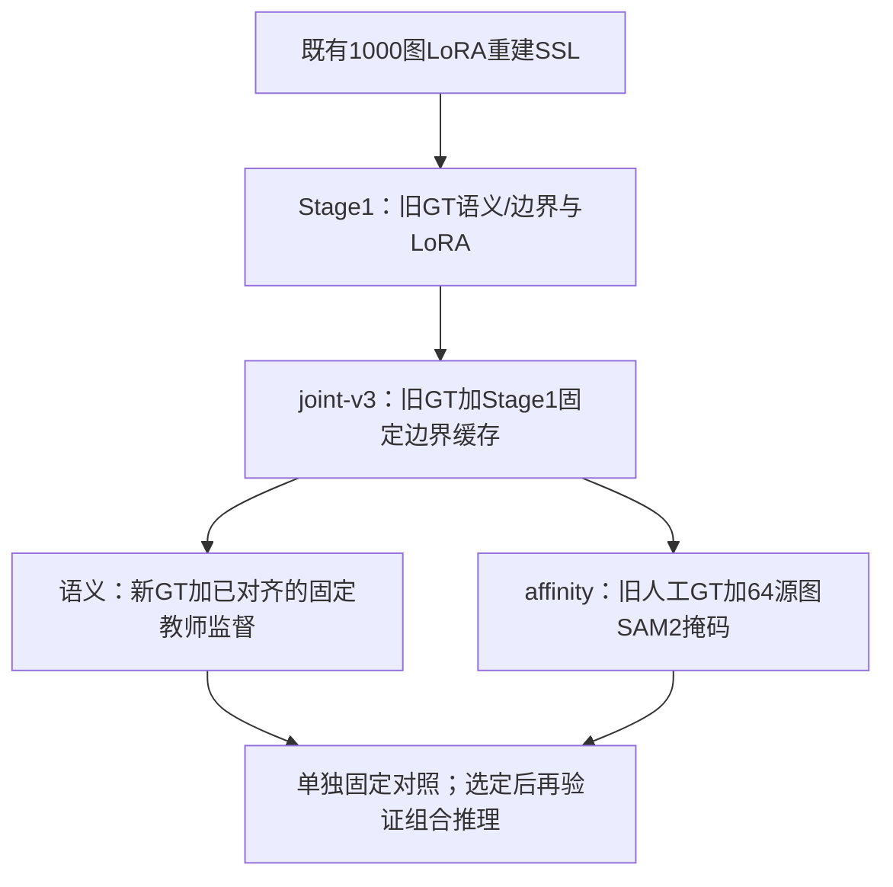

# 训练链路统筹与任务一致性计划

2026-09-19后续决策：用户选择[Stage1→最终任务联合LoRA→两头精修](STAGE1_FINAL_TASKS_20260919.md)，
正式串行训练及固定部署内部对照已完成：选中联合e35、几何e57、语义e14，共6600次实际更新。
内部原始语义与面积改善，但七图匹配1000→971；用户回报黑盒`0.8448/0.7699/80.735`，较统一组合低4.190，拒绝晋级。
当前拟先进行无训练的两头输出交换，保留各自encoder/LoRA以定位部署差异；尚未实现或启动，不继续叠加训练变量。
下文“先固定教师消融再EMA”的安排保留为先前计划；本轮整套joint-v3替代不单独回答旧固定教师是否有贡献，亦不作为纯删除对照。

2026-09-17，按用户本任务回报S官方`(mIoU, 面积项)=(0.8393,0.8714)`整理。
最初统筹阶段核对本地配置、实际调用路径、既有运行回执与提交包；另只读核对服务器S运行目录的三份源码，
用CPU合成输入复现一致性坐标问题，当时未修改训练实现或启动训练。
两项后续实验已回分：S-align为`0.8407/0.8620/85.135`，V-noSAM2为`0.8362/0.8181/82.715`。
保留64源图SAM2几何监督；接受S-align的小幅得分取舍，以正确对齐作为研究起点，原S保留成绩回退。
这轮是收束实验与明确下一步计划，未修改训练代码或启动新训练。
具体训练、部署、提交包与黑盒依据见[双实验记录](ALIGN_NOSAM2_EXPERIMENT_20260917.md)。

2026-09-19更新：[S-align+V组合](UNIFIED_ALIGNMENT_AUDIT_20260919.md)已经完成内部最终部署对照、
68图推理及本地打包，用户回报官方`0.8416/0.8569/84.925`，接受为后续统一研究对照。
组合监督审计已重新读取实际训练源码并完成真实权重无更新诊断；后续Stage1替代训练及内部评估已按上文完成。

## 成绩与判断边界

| 组别 | 语义 | 几何 | mIoU | 面积项 | 总分 |
| --- | --- | --- | ---: | ---: | ---: |
| L | E10a | V6 FPN初始化、旧GT长程G2 | 0.8416 | 0.8538 | 84.770 |
| N | E10a | V6 FPN初始化、新GT长程G2 | 0.8415 | 0.8476 | 84.455 |
| V | E10a | joint-v3 FPN初始化、旧GT长程G2 | 0.8430 | 0.8499 | 84.645 |
| S | 新GT语义e20 | 沿用L | 0.8393 | 0.8714 | **85.535** |
| S-align | 新GT语义e13，修复在线空间对齐 | 沿用L | 0.8407 | 0.8620 | 85.135 |
| S-align + V | 同一S-align e13 | 沿用V e115 | 0.8416 | 0.8569 | 84.925 |
| Stage1最终任务替代 | 联合适配后语义精修e14 | 同一新LoRA下几何精修e57 | 0.8448 | 0.7699 | 80.735 |
| V-noSAM2 | E10a | V初始化，人工重采样替代SAM2 | 0.8362 | 0.8181 | 82.715 |

总分按`50*(mIoU+面积项)`计算。S相对固定几何对照L提高0.765分，其中面积贡献+0.880、
mIoU贡献−0.115；mIoU降低0.23个百分点，面积项提高1.76个百分点。
S作为当前官方总分最高候选保留，L/V保留回退；尚未自动切换默认部署入口。
S-align相对S为mIoU+0.14个百分点、面积项−0.94个百分点、总分−0.400，
按工程容忍接受正确实现，不宣称“已证明无影响”。V-noSAM2相对V两个分项均降、总分−1.930，停止晋级。
统一组合相对S-align+L为mIoU+0.0009、面积项−0.0051、总分−0.210；相对V总分+0.280。
接受正确对齐语义与简化几何共同作为研究起点，原S仍高0.610分，保留最高分回退。
这不证明统计等效，也不把面积项差异认定为随机噪声；Stage1替代现已官方回分，mIoU+0.0032、面积项−0.0870，
总分下降4.190，整套替代配方未通过，不再以内部面积改善作为继续晋级理由。

面积评价关注`铁素体总面积 / 铁素体实例数`。大区域误差、额外小碎片、类别改判都可能改变该比值，
不同错误也可能相互抵消。官方逐图聚合方式仍未核实；不能由一个汇总分断言普遍改善或统计显著，
也不能将确定性平台上同一个ZIP的重复提交当作训练方差检验。

只读比较本地L/S完整68图包：每张图的实例总数相同，总计5984；铁素体数量4106→4330，
46图增加、1图减少、21图不变。60图的预测铁素体平均面积下降，逐图相对变化中位数约−3.20%。
这说明输出变化较广泛，不只限于一两图；但没有官方逐图GT误差，不能证明得分收益也广泛，
不反演隐藏GT或据此调目标实例数。逐图诊断仅留在被忽略的
`output/20260916_semantic_newgt/blackbox_S_prediction_shift_20260917.json`。

还需区分GT收益与训练协议收益：S与历史E10a同时有增强、选优政策等差异。
配对S-old/S-new内部原始语义有差异，最终实例却接近；若需归因，已有S-old e7 + L/top2
是低成本官方对照，无需新训练。暂不把全部0.765分归功于补缝GT。

## 共同上游尚未消融

`既有无标签LoRA重建SSL → Stage1旧GT监督 → joint-v3旧GT监督 + Stage1边界伪标签`

- 重建SSL继续复用，不重新预训练LoRA。
- joint-v3更新过共享LoRA和任务分支；其无标签部分是Stage1缓存边界监督，权重0.4，
  语义无标签权重0。1000图是源池，每轮250的配置实际最多62批×4=248次抽取，
  还受缓存覆盖/排除清单约束；没有历史逐图访问记录，不能声称1000图全部访问过。
- joint-v3仍通过共享LoRA、边界FPN初始化、固定语义教师三条路径影响下游。
  不能因语义学生头被重置，就宣布joint-v3已被消融。
- 已有张量核验显示joint-v3与V6的语义/LoRA相同，边界FPN不同。V消融的是V6独立边界训练，
  不等于所有代码中的V6文件引用已替换。

## 保留的训练流程与数据依赖

逻辑上按四层组织：既有LoRA重建SSL → Stage1 → joint-v3 → 两个独立下游任务。
若从头重训，最后一层含语义和affinity两个训练任务，因此实际是五个训练任务，
另有GT准备与边界缓存生成；不把这些隐藏成“一次四阶段脚本已经实现”。
后续实验复用现有上游，只改下游任务；`repro/train.py`仍是历史长链编排，尚未改成简化链入口。

图中语义的joint-v3来源按已核验的语义/LoRA同值关系表示；当前配置仍读取V6文件，见下文。

| 项目 | S-align语义分支 | V简化几何分支 |
| --- | --- | --- |
| 共享特征 | 冻结SAM2及joint-v3同值LoRA | 相同 |
| 任务模块初始化 | 重置完整语义FPN、输出头及高分辨率路径 | 继承joint-v3边界FPN；上采样/affinity输出层随机初始化 |
| 人工训练目标 | 25张补缝新GT | 26张原LabelMe GT |
| 验证目标 | 7张补缝新GT | 6张原LabelMe GT |
| 额外监督 | 固定旧语义教师的在线无标签预测 | 已确认的64源图SAM2无类别几何掩码 |
| 全1000图池上的当前任务一致性 | 有固定教师语义项，已共享空间变换 | 没有 |
| 预算 | 20轮，1240次实际更新、0 AMP跳步 | 120轮，52次抽取/轮、batch2，3120次计划更新 |
| 选优 | 新GT验证语义loss最低，e13 | 原GT验证affinity loss最低，e115 |

S不是接着joint-v3语义头微调。先复制固定教师，再重置学生语义模块；只有共享特征及教师保留上游信息。
新GT来自原32张标注的radius8补缝，未增加人工图数；语义、实例及有效域均来自同一实例图，
剩余unknown保持ignore。旧文件名用于固定样本集合，S-new不再混读旧标签值。
但教师、共享LoRA和共同上游仍继承旧GT信息，因此不是“全链仅新GT”。

S-align语义保留固定教师权重0.12→0.03、置信度0.90、锐化温度0.70；每轮从无标签池随机抽248次，
20轮共4960次抽取。教师不会随学生更新，因此当前不是EMA。
`unsup_seg_weight=0`被冷启动逻辑覆盖，不能据一个键声称语义没有无标签监督。

V几何每轮52次抽取、batch2，人工/SAM2各50%概率混采；FPN学习率5e-5，
新层1e-4，最低5e-6。只训练geometry decoder，无标签1000图不进入这个G2训练器。
当前L/N/V并未继承G4b的原生裁剪或人工覆盖↔未覆盖缝隙0.20负边策略；SAM2未覆盖区保持ignore。

N曾将几何训练的26张人工GT换成新GT，但保留V6初始化，验证仍是旧GT；其回分接近但未超过L。
它没有自动成为V的组成部分。若未来要求两头人工目标统一新GT，应独立测试V初始化下的新GT几何，
不要与EMA一并改动。

**新语义已有三份组合回分：S+L、S-align+L及S-align+V。**
简化组合`S-align语义 + V几何`已完成完整推理和官方验证，总分84.925；原S语义+V仍未测试。
保留G2内SAM2数据并未增加一个几何训练阶段；已移除的G0/G0-long/G1/G4b不恢复，
V省去独立V6边界训练的结论也不受这次SAM2数据消融失败影响。

主要入口与权重：

- S训练：`config/train/stage2_semantic_gt_new20.yaml`；
  `outputs/stage2_semantic_gt_new20_20260916/best_model_stage2.pth`，训练e20，SHA前缀`7e6e59f9`。
- 后续语义研究入口：`config/train/stage2_semantic_gt_aligned20.yaml`；
  `outputs/20260917_align_nosam2/semantic_training/best_model_stage2.pth`，e13，SHA前缀`ea905a94`。
- L几何：`config/train/affinity_geometry_g2_direct_long_oldgt.yaml`；
  `outputs/20260914_g2_long_oldgt/training/best_affinity.pth`，e115，SHA前缀`c71a302c`。
- V几何：`config/train/affinity_geometry_g2_skip_v6.yaml`；
  `outputs/20260916_g2_skip_v6/training/best_affinity.pth`，e115，SHA前缀`9bfacdad`。
- 当前S部署：`config/experiments/affinity_semantic_newgt_l_top2_20260916.yaml`，
  单共享encoder、S语义、L affinity，gated-top2/high0.65/low0.45/seal2/局部重建8/
  受阻分水岭/probability_mean，`legacy_none`。
- 完整权重/包哈希及指标见[语义实验](SEMANTIC_NEWGT_20260916.md)、[V实验](G2_SKIP_V6_20260916.md)。

## 必须先处理的实现问题：在线语义一致性坐标错位

以下为修复前审计：当时本地及服务器S运行目录的相应三文件按LF统一后完全相同，行号是当时快照：

1. `data/dataset_semi.py:421–424`：教师weak图仅letterbox；学生strong图另做随机翻转/90度旋转。
2. `data/dataset_semi.py:446–452`及collate没有把变换参数交给损失；只有离线边界缓存目标被显式同变换。
3. `train_stage2.py:865–897`将两张不同坐标的视图直接传入在线损失，未额外对齐。
4. `utils/loss_semi.py:454,467,481`分别计算teacher(weak)、student(strong)，直接逐像素相减。
   S启用这条语义项，且没有使用离线缓存绕开它。

这会把不同物理位置当作同一像素监督。教师固定或EMA均不能自动解决坐标问题。
在服务器CPU用实际损失函数和一个对翻转完全一致的合成模型复现：同视图损失0，
仅学生翻转时错误损失0.4646745，两侧共享翻转时恢复0。关闭锐化以隔离坐标因素，不使用真实测试图。
服务器`utils/loss_semi.py` SHA256为
`a38bb9e9c342d5c649735efc54dcecf4f312e332edb7458f23ec3408122b7968`。
回执在被忽略目录的`semantic_alignment_runtime_audit_20260917.json`与
`semantic_alignment_reproduction_20260917.json`。

该问题不否定S官方成绩，也未量化对分数的损害；不能预言修复必然上涨。
joint-v3使用的离线边界缓存已有几何变换，不能据此一概否定其无标签边界训练。

## 原计划及执行状态：任务一致性对照

以下第1项已完成，第2—4项保留为候选。文首Stage1替代黑盒未通过，当前建议先定位输出差异，不同时启动这些训练对照。

1. **统一部署起点，只有工程核验和推理。**
   已核验`S-align+V`组合，相对已测S-align+L只换几何；兼容、最终输出与独立黑盒均完成。
   总分84.925，较S-align+L低0.210分；接受为后续统一研究对照，同时保留各自原有单变量对照。
   语义配置当前仍加载V6作共享特征/固定教师载体；已有语义与LoRA逐张量同值证据，
   引用改为joint-v3前仍需验证相关前向及随机初始化轨迹，不能把“V6阶段消融”写成文件依赖已全部移除。
   这项不新训模型，也不与EMA效果混为一项实验。
2. **最小新增训练：关闭语义一致性损失，对照已有S-align。**
   从同一初始化重跑20轮，保持新GT25/7、增强、62步/轮、LoRA冻结和loss选优。
   仅将`semantic_cold_start_training.distill_weight_start/end`置0；`unsup_seg_weight`已为0，
   单改它不能关闭当前固定教师监督。保留抽样/增强随机过程和1240次实际更新，核验没有其他无标签状态反馈。
   这回答“在复用相同历史SSL/joint-v3的前提下，本阶段固定教师语义项是否贡献收益”，
   不是全链取消无标签数据。最终固定同一几何评价，不因少了无标签loss而缩短训练步数。
3. **语义EMA作为下一项独立方法对照。**
   EMA是平滑跟随学生权重的教师，用它在弱外观图上的预测约束强外观学生。
   当前冷启动分支显式强制教师固定，改`ema_decay`不会启用EMA。
   学生完整语义头随机重置，不能直接把旧V6固定教师与随机学生的权重平均当作可靠起点。
   采用训练任务内部的共同warm-up后，从同一个学生复制教师；成对比较教师保持固定或按EMA更新，
   两组具有相同warm-up、教师/学生起点、总预算、增强、可靠域及损失权重。
   因教师来源变化，这个配对固定教师组不能直接用旧S-align替代；结果应说明是在检验EMA更新还是整套新协议。
   可靠预测不足时允许该项暂不生效，不通过降低置信门槛强行凑覆盖率。
4. **affinity加入任务一致性，同时保留人工旧GT与64图SAM2监督。**
   以V为对照，保持120轮、每轮52个监督样本、原学习率及固定语义；在同一更新内增加无标签损失，
   不用无标签样本挤掉SAM2比例，也不同时换几何GT或解冻LoRA。
   先完成监督warm-up，再由同一学生初始化EMA几何教师；弱/强视图共享几何，只改变外观。
   分别检查可靠正连接、负连接及跨界误连，防止大量粒内正连接掩盖关键错误；两端落在有效图像域的边才参与。
   若以后采用不同几何变换，必须同时处理像素坐标和方向通道。
   选优仍依据预先固定的有标签验证loss，完整实例/面积及黑盒用于晋级，不拿EMA一致性loss挑轮。

无标签数据来自赛方训练池，正式测试图不进入上述训练。当前S/align在线路径读取全目录1000图，
代码没有按人工25/7划分剔除无标签同源图，因此“有标签验证图”不能自动称为完全未见的图像。
下一轮记录池清单、实际唯一访问量、类别/正负边的有效监督覆盖；相同对照组使用相同池。
若要建立严格图像留出集，需两组统一排除并重建对照，不能只改EMA组的数据划分。

一致性应并入现有语义/几何训练任务内部，不增加手工串联的一长串新预训练阶段。
原计划暂不重跑SSL、改joint-v3、解冻共享LoRA或同时替换几何GT。
用户随后选择优先替代joint-v3并联合适配LoRA，见文首；这项流程比较不再满足上述单变量任务一致性对照。
更换共享特征后两头均须重新适配，不能直接接回旧S/V头；SSL与几何GT仍按该实验的固定方案保留。
若需单独解释新GT的黑盒贡献，已有S-old+L仍是无需训练的补充对照，不代替任务一致性的实际收益验证。
